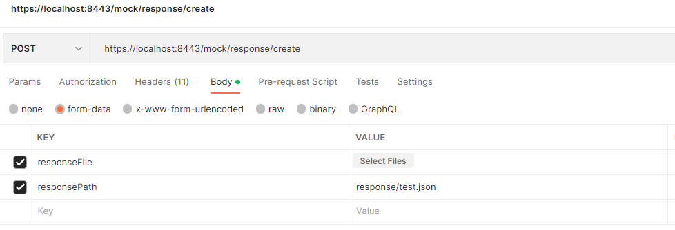

## light-common-mock-api

This service can be used to build dynamic mock API by configurable file or user input (by POST request); 

### Prerequisites

- JDK 11

- Maven 3.8.1+

- Light4j


### Summary

There are two ways to setup the mock API config:

- Use config file (mapping-config.yml/values.yml), the config for the mock API will be load at service startup.

Here is the sample config:

```
  /mesh/core:
    GET:
      required: id,name
      cases:
        - conditions:
            - {name: "id", operator: "EQUALS", value: "1111"}
          response:
            statusCode: 200
            responsePath: response/core1.json
            headers:
              - {headerKey: "serviceId", headerValue: "2222"}
              - {headerKey: "roleId", headerValue: "1111-01"}
        - conditions:
            - {name: "id", operator: "EQUALS", value: "2222"}
            - {name: "name", operator: "EQUALS", value: "name2"}
          response:
            statusCode: 200
            responsePath: response/core2.json
            headers:
              - {headerKey: "serviceId", headerValue: "2222"}
              - {headerKey: "roleId", headerValue: "1111-02"}
      defaultResponse:
        statusCode: 200
        responsePath: response/core3.json
        headers:
          - {headerKey: "serviceId", headerValue: "2222"}
          - {headerKey: "roleId", headerValue: "1111-01"}
    POST:
      defaultResponse:
        statusCode: 200
        responsePath: response/core1.json
  /mesh/book:
    GET:
      cases:
        - conditions:
            - {name: "id", operator: "EQUALS", value: "1111"}
          response:
            statusCode: 200
            responsePath: response/book1.json
            headers:
              - {headerKey: "serviceId", headerValue: "2222"}
              - {headerKey: "roleId", headerValue: "1111-01"}
      defaultResponse:
        statusCode: 200
        responsePath: response/book2.json
        headers:
          - {headerKey: "serviceId", headerValue: "2222"}
  /mesh/client/{client}:
    GET:
      cases:
        - conditions:
            - {name: "clientId", operator: "EQUALS", value: "1111"}
          response:
            statusCode: 200
            responsePath: response/client1.json
            headers:
              - {headerKey: "roleId", headerValue: "1111-01"}
      defaultResponse:
        statusCode: 200
        responsePath: response/client2.json

```

- Use the POST endpoint (/mock/create) to create mock API config dynamically.

  For detail please refer the endpoints section


### Endpoints:

- GET /mock/api     -- To get mock api config for specified path & method (query parameters) from the repository:

required parameters:
 - method      mock api http method (GET/POST/PUT/DELETE/PATCH)   
 - path        mock api path
   use URL encoding for special characters
   - '/'   --->  %2F
   - '{'   --->  %7B
   - '}'   --->  %7D
   
  For reference of URL encoding, please refer  [here](https://www.w3schools.com/tags/ref_urlencode.ASP);  

Sample URL:  /mock/api?path=%2Fmesh%2Fcore&method=GET


- POST /mock/create       -- To create mock API config dynamically 

Sample request payload

```text
[
    {
        "path": "/mesh/query",
        "method": "GET",
        "requiredParam": "branchCode,accountCode",
        "defaultResponse": {
            "statusCode": 200,
            "responsePath": "response/book1.json",
            "responseBody": null,
            "headers": null
        },
        "cases": [
            {
                "response": {
                    "statusCode": 200,
                    "responsePath": "response/book2.json",
                    "responseBody": null,
                    "headers": [
                        {
                            "headerKey": "roleId",
                            "headerValue": "1111"
                        }
                    ]
                },
                "conditions": [
                    {
                        "name": "branchCode",
                        "jsonPath": null,
                        "value": "510",
                        "operator": "EQUALS"
                    }
                ]
            }
        ]
    }
]
```

- POST /mock/response/create      - To create mock API response dynamically 

In the mock API config, we can specify the API response by two different fields:

            "responsePath": "response/book1.json",
            "responseBody": null,

So user can specify the response body dynamically by using "responseBody", but it may not fit with large JSON payload. 
For large JSON payload, we can specify it from "responsePath", which has to be pre-defined in the classpath. 

To load the response JSON dynamically, we can use /mock/response/create (POST) to create response.

The endpoint use request body use form-data type:  "multipart/form-data"




### local build and start service

```
cd ~/workspace
git clone git@github.com:mservicetech/light-common-mock-api.git
cd light-common-mock-api

mvn clean install

java -jar  -Dlight-4j-config-dir=configuration/local target/plight-common-mock-api-1.00.jar
```

### some error response

- mock api path not existing:

```
{
    "statusCode": 404,
    "code": "ERR10007",
    "message": "INVALID_REQUEST_PATH",
    "description": "Request path /mesh/query cannot be found in the spec.",
    "severity": "ERROR"
}
```

- missing required path:

```
{
    "statusCode": 400,
    "code": "ERR11000",
    "message": "VALIDATOR_REQUEST_PARAMETER_QUERY_MISSING",
    "description": "Query parameter name is required on path /mesh/core but not found in request.",
    "severity": "ERROR"
}
```